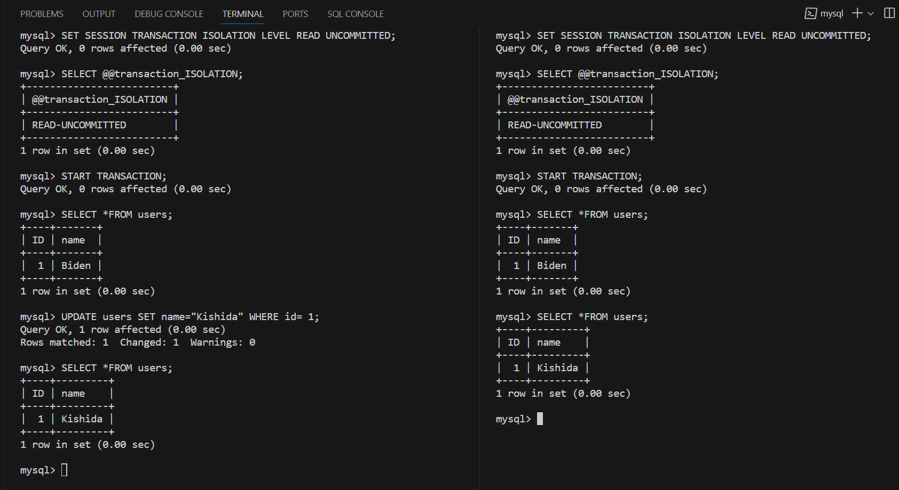
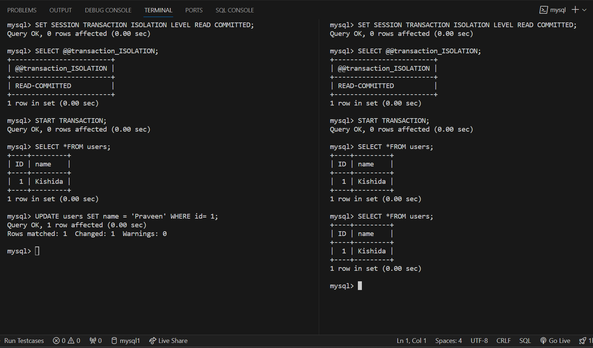
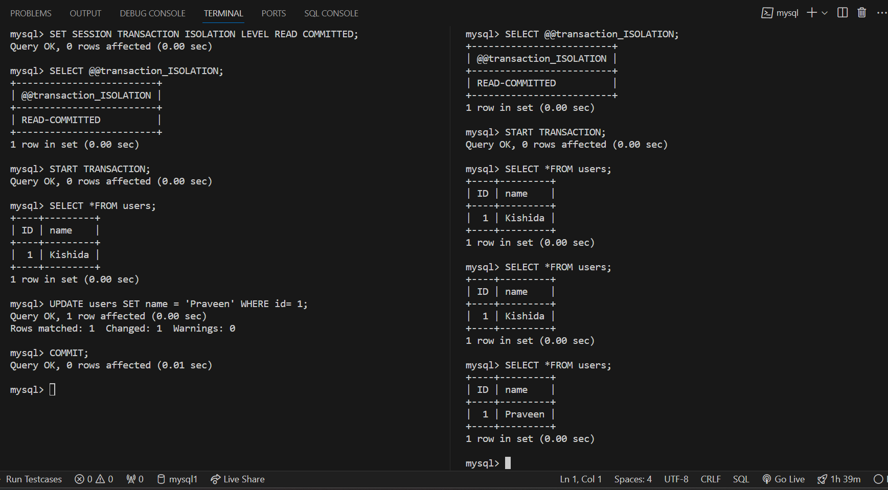
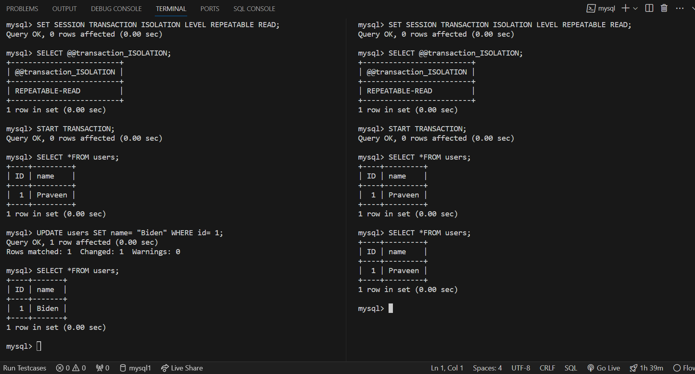
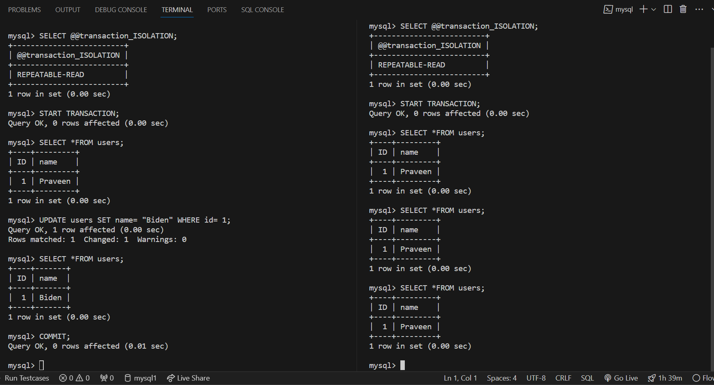
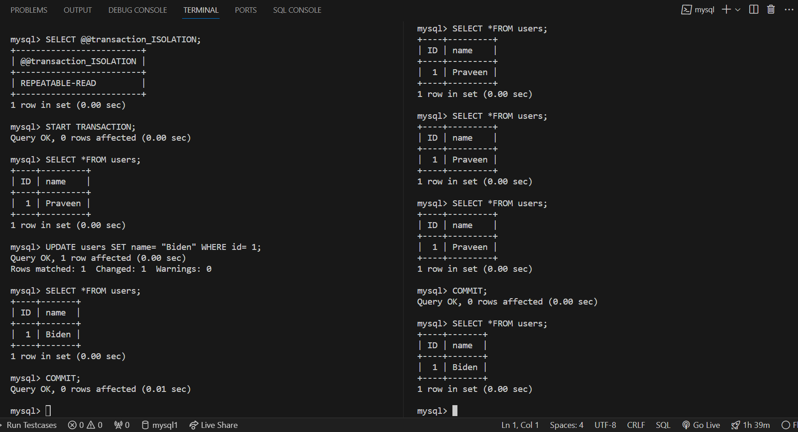
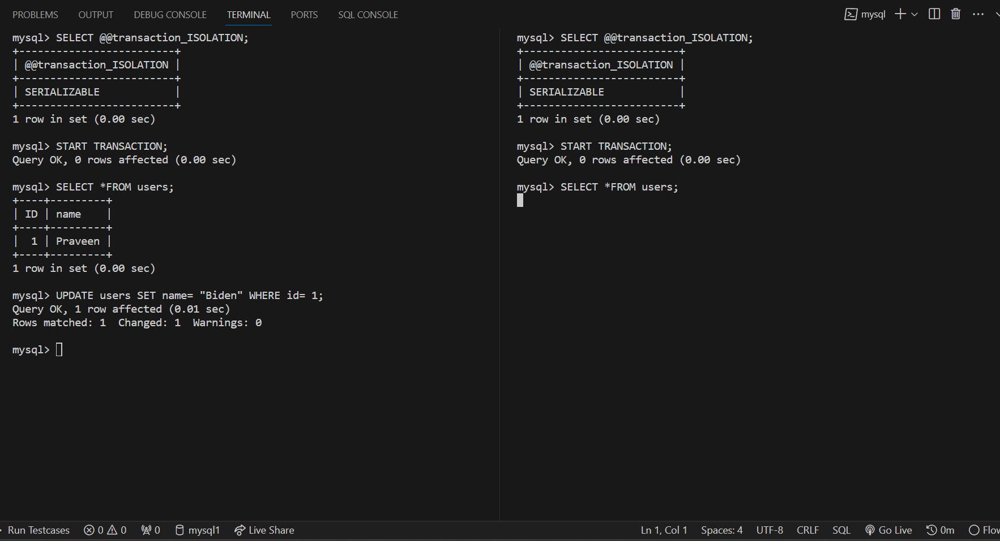
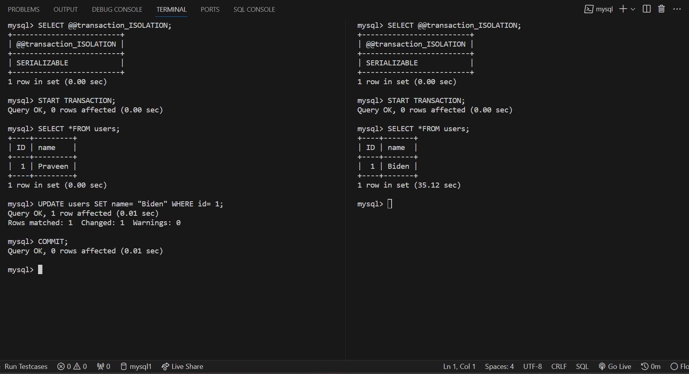

#### Some commands that may come handy:  
 

> To get started with Mysql:
> `mysql -u user-name -p`
>
> To show the list of Databases:  `SHOW DATABASES;`
> 
> Delete Database: `DROP DATABASE IF EXISTS database-name;`  **Exercise Caution!**
>
> Check your current Database: `SELECT DATABASE();`
>
> Navigate to other database: `\u database-name`
>
> To check the current Isolation Level: `SELECT @@transaction_ISOLATION;`
>
> To set auto-commit to 0 : `SET autocommit = 0;`
> Noe: Auto-commit commits every line as and when it happens.
>
> To start a transaction: `START TRANSACTION;`
>
> To commit a transaction manually: `COMMIT;`
>
> To change the current Isolation Level: `SET SESSION TRANSACTION ISOLATION LEVEL READ UNCOMMITTED/READ COMMITTED/REPEATABLE READ/SERIALIZABLE;`
>
> To rollback changes made to the data instead of committing: `ROLLBACK;`
>
> To check if the auto-commit is ON/OFF: `SELECT @@autocommit;`
>  > Returns 0: OFF  
>  > Returns 1: ON
>
> To enable auto-commit: `SET autocommit = 1;`
>

> - Read Committed is the default isolation level in PostgreSQL.
> - The default Isolation Level in MySQL is Repeatble Read.

##### Isolation Level: Read Uncommitted:⤵️
> You can see, we can access the uncommitted value in a concurrent transaction.

##### Isolation Level: Read Committed:⤵️
> You can see, we can only access the updated value, once it gets committed.

 

##### Isolation Level: Repeatable Read:⤵️
> You can see, In concurent transaction, it maintains the snapshot of the first read it made, now even if some other transaction comes and make changes to the data, still in the subsequent read it will maintain the data it read the first sweep.

 

 

##### Isolation Level: Serializable:⤵️
> If one transaction is making any changes to the data, you are not even allowed to read that data let alone update it.
> Once the changes are committed, the read/write statement that you fired, will get executed.

 

